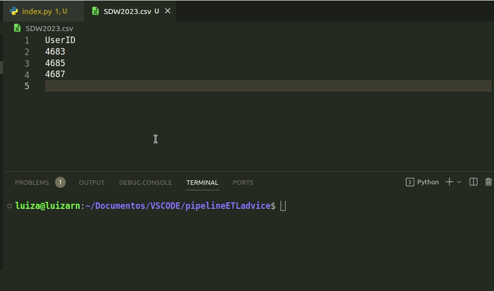

## Pipeline ETL Geradora de Conselhos

Este projeto faz parte de um desafio de projeto do BootCamp Dio em parceria com o Santander, de Ciências de Dados. O intuito era construir um pipeline ETL (Extração, Transformação e Carregamento), demonstrando a relação entre dados, Inteligência Artificial (IA) e APIs. A mudança que fiz foi trocar a API da IA por uma API pública que gera conselhos.

A ideia é ser um gerador de conselhos para usuários do aplicativo do banco, para que apareça no uso do aplicativo em algum momento, como uma forma de distração e um conselho aleatório diário.

Utilizou-se uma planilha CSV, o arquivo contém uma lista de IDs de usuários. Ela é usada para ambiente de desenvolvimento para pegar as informações de usuários e futuramente pode ser adaptado para ser ligado diretamente ao projeto completo. Para manipular os dados da tabela faz-se necessário a biblioteca Panda, para utilizá-la execute o seguinte comando:
     pip install pandas

Resumidamente, o pipeline funciona da seguinte forma:
* Extrai os IDs de usuário da planilha CSV.
* Recupera os dados do usuário para cada ID de usuário usando a API do Santander.
* Gera notícias de IA para cada usuário usando a API api.adviceslip.com.
* Armazena as notícias de IA geradas nos dados do usuário.
* Atualiza os dados do usuário usando a API do Santander.

Algumas possíveis melhorias para o código incluem:

- Adicionar suporte para diferentes idiomas.
- Adicionar a opção de personalizar as notícias de IA com base nos dados do usuário.

Faça o git clone, siga as instruções e execute o código para testar o pipeline.

  

